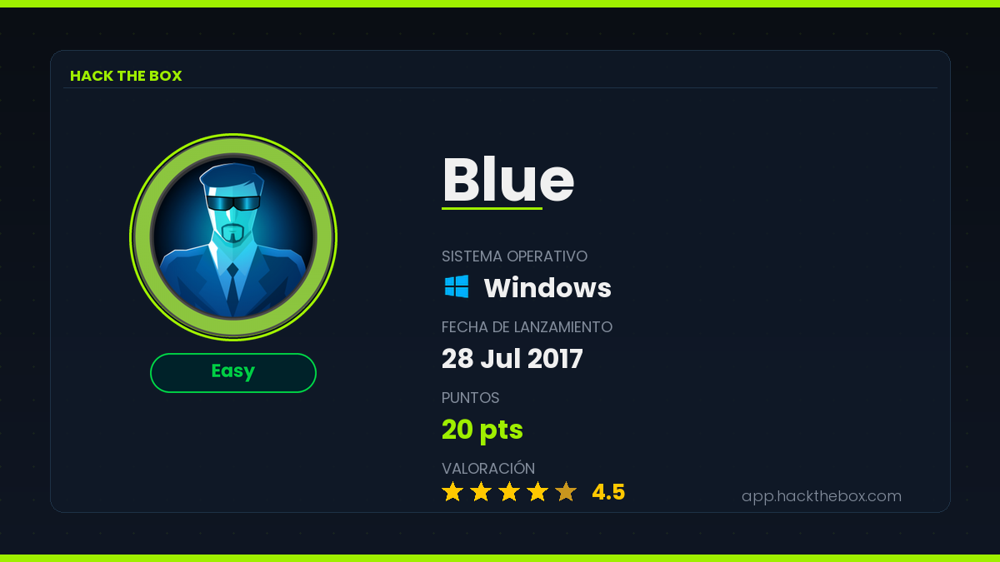
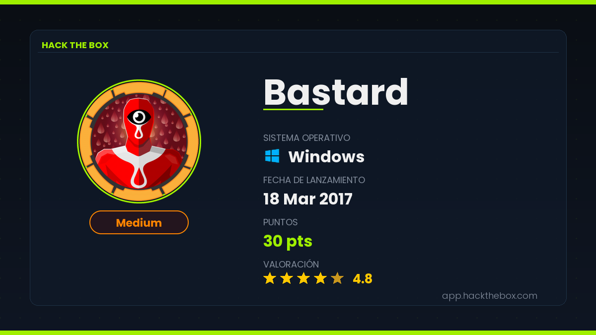
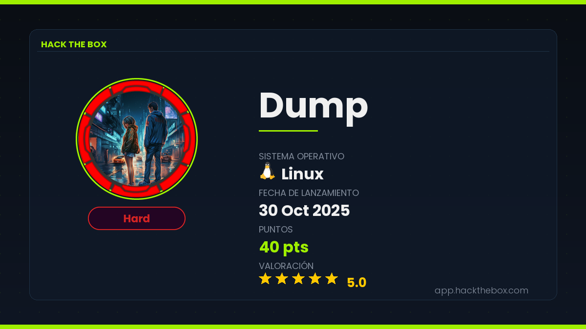
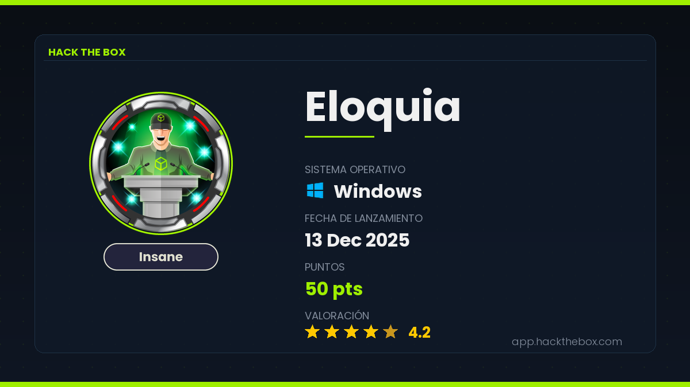

# HTB Cover Generator

Genera una portada visual en formato PNG con la información básica de cualquier máquina de [HackTheBox](https://www.hackthebox.com), lista para usar en writeups, presentaciones o repositorios.

## Ejemplos de resultados

A continuación se muestran algunas portadas generadas para distintas máquinas de HackTheBox:

| Blue | Bastard |
|:---:|:---:|
|  |  |

| Dump | Eloquia |
|:---:|:---:|
|  |  |

---

## Características

- Consulta automática a la API oficial de HackTheBox
- Descarga el avatar real de la máquina
- Muestra nombre, sistema operativo, dificultad, fecha de lanzamiento, puntos y valoración
- Badge de dificultad con color dinámico acorde a la paleta oficial de HTB (Easy / Medium / Hard / Insane)
- Icono del sistema operativo cargado desde PNG externo (subcarpeta `icons/`)
- Múltiples elementos (avatares, bordes redondeados) con antialiasing y renderizado avanzado mediante supersampling 4x
- Paleta de colores oficial de HTB (`#9FEF00`)
- Imagen de salida en PNG a resolución 1200×675 (16:9)
- Tipografías calculadas geométricamente para un alineamiento central perfecto
- Integración nativa y descarga de fuente Poppins para su uso constante, sin depender de librerías del Sistema Operativo

---

## Requisitos

- Python 3.10 o superior
- Las siguientes librerías:

```bash
pip install requests Pillow
```

> La fuente **Poppins** se encarga de descargar e incorporarse de forma automática vía GitHub OFL al primer uso del script, por lo que no hace falta instalar ningún paquete de fuentes manualmente.

---

## Uso

```bash
python3 cover_generator.py <nombre_maquina> --token <tu_api_token>
```

### Argumentos

| Argumento | Alias | Descripción |
|-----------|-------|-------------|
| `machine` | | Nombre o ID numérico de la máquina (ej: `Principal`, `622`) |
| `--token` | `-t` | API token de HackTheBox (**obligatorio**) |
| `--output` | `-o` | Ruta de salida del PNG. Por defecto: `<nombre>_cover.png` |

### Ejemplos

```bash
# Uso básico (guarda en principal_cover.png)
python3 cover_generator.py Principal --token eyJhbGci...

# Especificar ruta de salida
python3 cover_generator.py RouterSpace --token eyJhbGci... --output ~/Desktop/portada.png

# Usando el ID numérico de la máquina
python3 cover_generator.py 622 --token eyJhbGci...
```

---

## Obtener el API Token

1. Inicia sesión en [app.hackthebox.com](https://app.hackthebox.com)
2. Ve a **Profile → Settings**
3. En la sección **App Tokens**, crea un nuevo token
4. Copia el token generado y úsalo con el argumento `--token`

---

## Información mostrada en la portada

| Campo | Fuente |
|-------|--------|
| Nombre de la máquina | API HTB |
| Avatar / icono | Bucket S3 público de HTB |
| Sistema operativo | API HTB |
| Dificultad | API HTB |
| Fecha de lanzamiento | API HTB |
| Puntos | API HTB |
| Valoración (estrellas) | API HTB |

---

## Colores de dificultad

Los badges de dificultad usan la paleta de colores oficial de HackTheBox:

| Dificultad | Color |
|------------|-------|
| Easy | Verde `#94D457` |
| Medium | Naranja `#FF9500` |
| Hard | Rojo `#FF4141` |
| Insane | Gris claro `#E1E1D7` |

---

## Iconos de sistema operativo

Los iconos se cargan desde la subcarpeta `icons/` ubicada en el mismo directorio que el script. El nombre de cada fichero debe coincidir con el siguiente mapeo:

| Sistema operativo | Fichero |
|-------------------|---------|
| Windows | `icons/windows.png` |
| Linux | `icons/linux.png` |
| FreeBSD | `icons/freebsd.png` |
| OpenBSD | `icons/openbsd.png` |
| macOS / Darwin | `icons/mac.png` |

Los iconos se redimensionan automáticamente a 28×28 píxeles manteniendo la relación de aspecto. Si el fichero correspondiente a un SO no se encuentra, se muestra un icono de fallback con la inicial del nombre del sistema operativo.

Para añadir soporte a un nuevo SO, basta con colocar su PNG en `icons/` y añadir la entrada correspondiente al diccionario `_OS_ICON_FILES` dentro del script.

---

## Estructura del proyecto

```
htb-cover-generator/
├── cover_generator.py       # Script principal
├── README.md                # Este fichero
├── fonts/                   # (Automático) Fuentes Poppins para uso de la tarjeta
└── icons/                   # Iconos de sistemas operativos
    ├── windows.png
    ├── linux.png
    ├── freebsd.png
    ├── openbsd.png
    └── mac.png
```

---

## Notas

- El script no requiere que la máquina esté activa o retirada; funciona con cualquier máquina a la que tengas acceso con tu cuenta.
- Si el avatar no puede descargarse (por cambios en la infraestructura de HTB), se genera un placeholder con la inicial del nombre de la máquina.
- Si un icono de SO no se encuentra en `icons/`, el script continúa sin interrumpirse y muestra un icono de fallback con la inicial del SO.
- Los mensajes de consola del script están en español.
